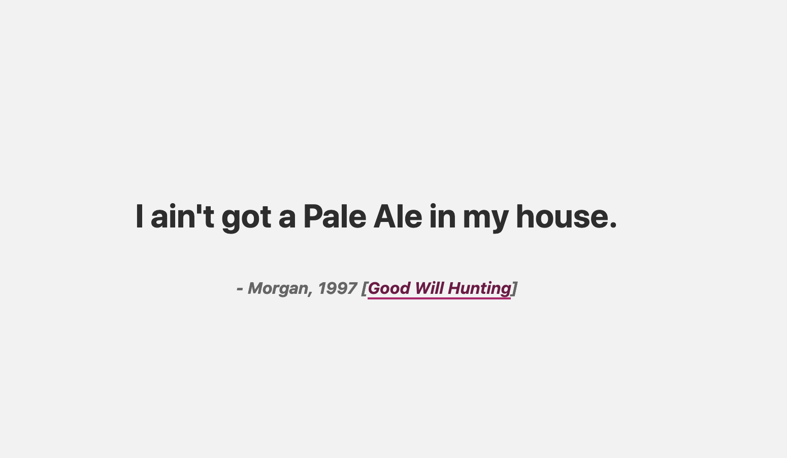

# Play it again, Pale Ale

> Displays a random movie quote from IMDB but where a noun has been replaced by a type of beer. Could be used to find that new name for your new batch



## Running

```
yarn && yarn start
```

Visit: [`localhost:3000`](http://localhost:3000)